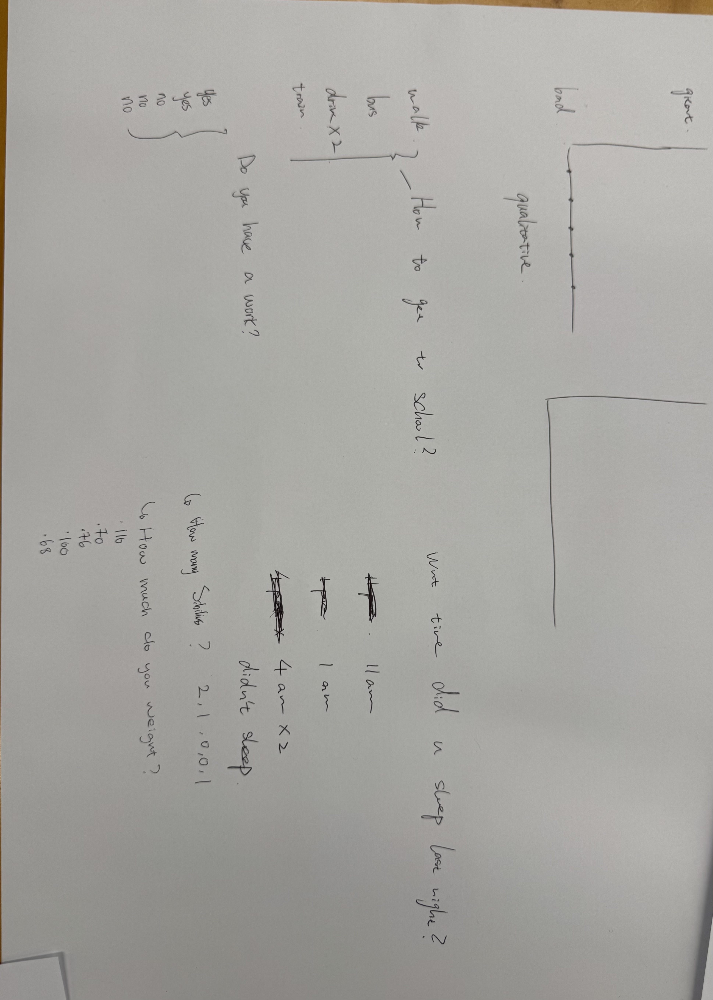
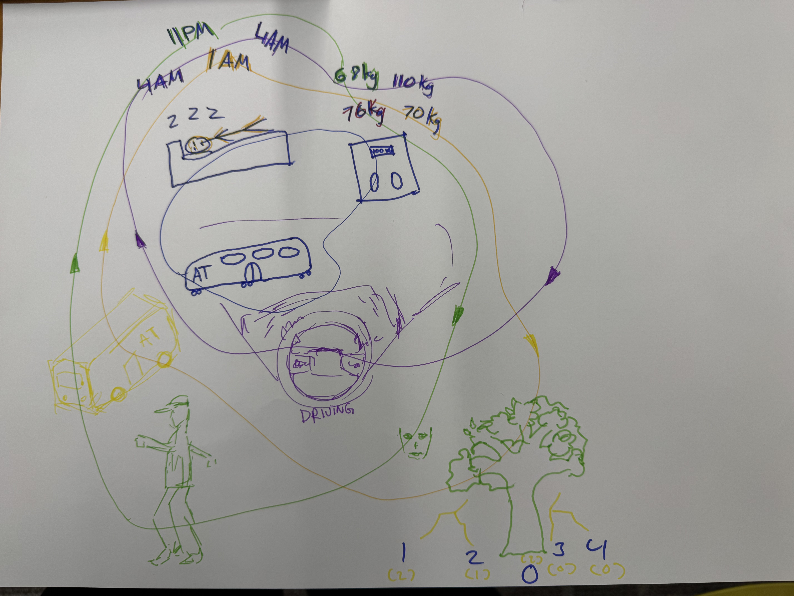
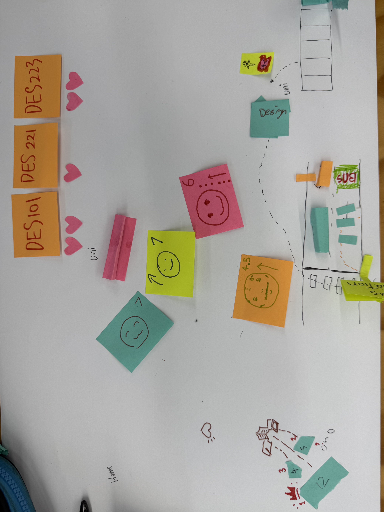
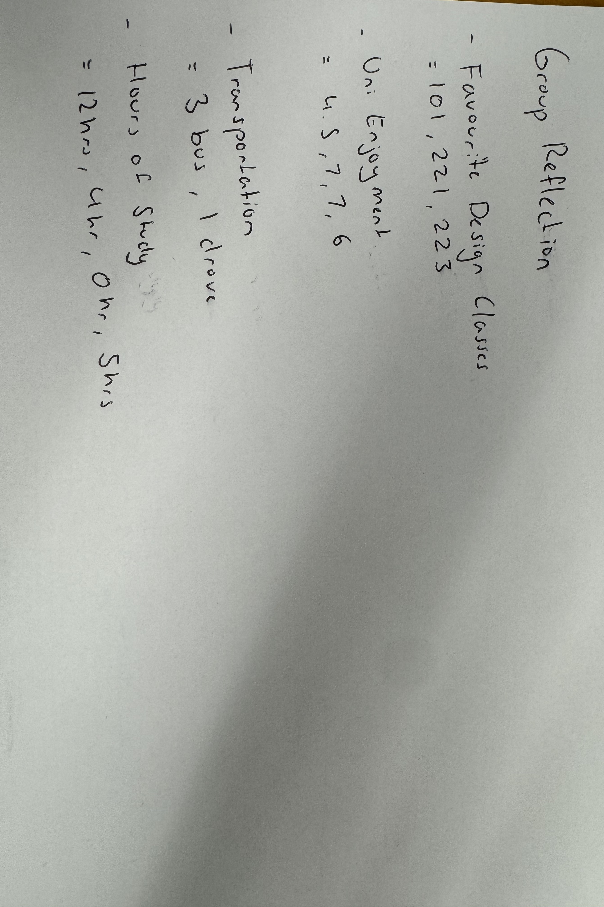
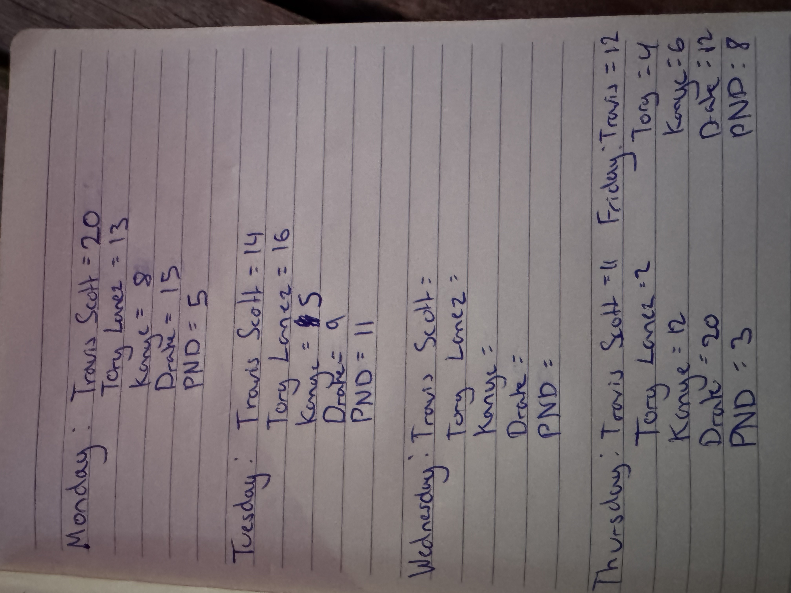
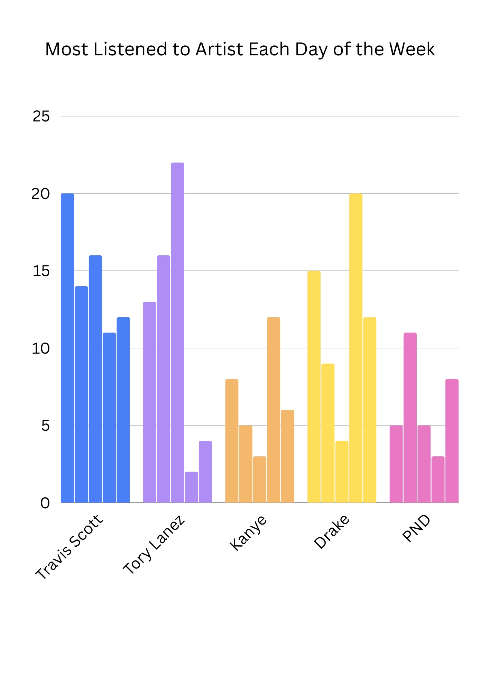
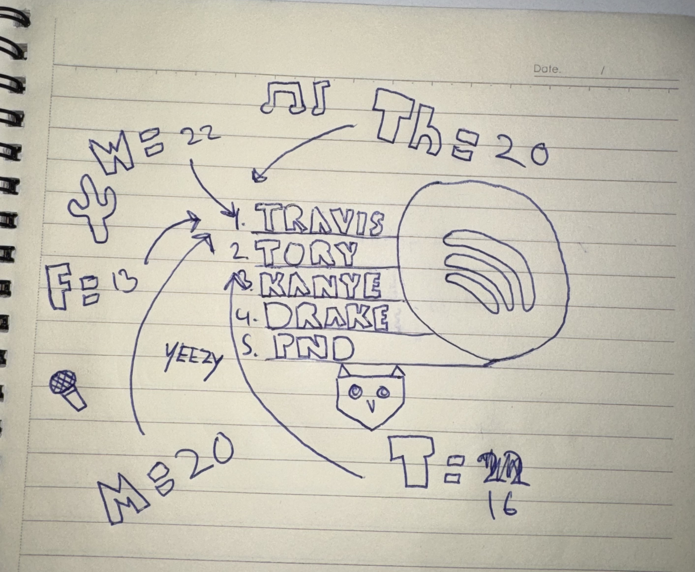
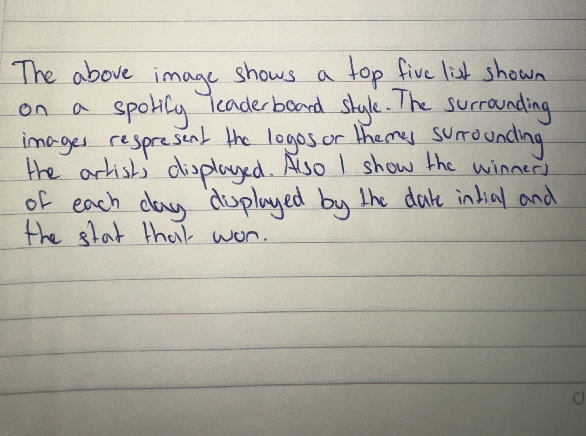

## Week 01
In the first of class our tutor went through the introduction section of this course, then proceeded to dive into the course by beginning with the definition of data and how it impacts us as individuals. Throughout this tutorial we grouped into fives to begin our first experiment.

### Data Drawings
 The first experiments brief instructed our group of five to get together and ask five personal questions too each other that we were all comfortable answering. The brief gave us examples such as 'How many tabs do you have open on your phone right now?' to make for each other.

 Our five questions that we constructed were as follow.

 1. How did we get to university today?
 2. Do you have a job?
 3. What time did you sleep last night?
 4. How much do you weight?
 5. How many siblings do you have? 

 These following questions were then answered by each member of the group. The image below shows the results of those questions.

  

  After gathering all the data from our group we then proceeded to create a visual piece that showed off our answers using different colours, drawings and text. The goal was to be able to represent who we are through our answers so another group would be able to guess what our questions were once we swapped pages.

  The final drawing is shown below.

  

   The next step forward was to swap our completed drawings with another groups and figure out what their questions were through their visual pieces and answers. Having a look through their page our group concluded that their five members asked each other the following questions.

 1. What are your favourite design classes?
 2. How much do you enjoy from 0-10?
 3. What mode of transportation did you take to uni?
 4. How many hours of study did you do last night?

There drawings and our answers can be shown in the images below

    
    

### Reflective Summary

Overall the first weeks experiment was extremly engaging and allowed for creative freedom and an opportunity to socialise with my classmates getting to know them better. Also attending class allowed for me to communicate with my tutors about the coursework and ask questions about the upcoming assignments and softwares we'll be using.

### Independent Data Potrait

For the individual section of this experiment I chose to track the artists I most frequently listened to on a daily basis across a week. This was done by tracking every song I listened to and making a graph comparing the number of song pers day and which artist made them. 

The first part of my experiment included getting a notebook and writing down all the songs I listened to under headings of each day. A image has been attached below to show my collection of the data.

The next part was to make a hand drawn visual diagram similar to the one completed in our group assignment. The first side of my page shows my top five artists of the week by showing drawings of each artist individual logos and branding. The arrows represent the days their dedicated to and number of songs by them I listened to. In the middle is a spotify style UI showing my overall top five artists of the week. 

The second side of the paper is the legend I made to explain my visual system. 

### Reflection

The process of collecting the data was simple but required consistency. I used a notebook and wrote down every song I listened to under headings for each day of the week. This manual process made me more aware of my listening habits because I had to consciously record each entry rather than relying on automated digital tracking. While it took some effort to keep up with the recording, it also made the dataset feel more personal and intentional. Once the data was collected, I translated it into a hand drawn visual diagram. Creating the visualisation was an engaging process because it allowed me to think creatively about how to communicate information through drawings, symbols, and layout rather than relying on standard digital graphs.

Through the visualisation process, I noticed patterns that I would not have recognised otherwise. For example, certain artists appeared repeatedly on specific days, while others were only listened to occasionally. This revealed that my music choices often relate to mood or context, such as listening to particular artists while studying or during travel. I also noticed that although I listen to a wide range of songs, a small number of artists dominate my weekly listening. Seeing this visually helped emphasise how strong those preferences actually are.

Overall, this exercise highlighted how everyday activities can be turned into meaningful datasets when observed closely. It also showed that data visualisation does not always need to rely on digital tools; hand-drawn representations can communicate patterns and insights in a more personal and expressive way. The process encouraged me to reflect more deeply on my habits and how design choices influence the way data is interpreted.

