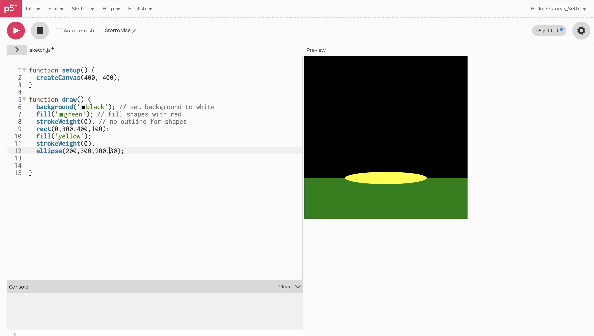
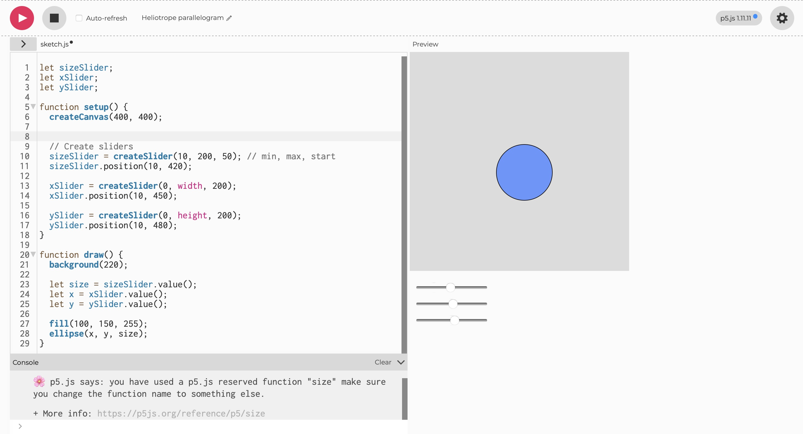

## Week 02
 
Our second tutorial of the class was quite information heavy as this class we dove into a new format of code. We were introduced to a online website called p5.js. This website allows users to use a coding language called JavaScript to create artistic images that can either be static or interactive. 

### Interactivity 

In Activity 1, I learnt the basics of drawing with code by creating a simple composition using at least three shapes such as rectangles, triangles, lines, or ellipses. We experimented with properties like colour, size, position, and the order of code instructions to understand how these changes affect the visual outcome.

In Activity 2, We then built an interactive sketch using DOM elements like buttons, sliders, and text inputs. These controls allow users to change elements on the canvas, such as adjusting the size of a shape with a slider, resetting or randomising the drawing with a button, or displaying text entered by the user.

In Activity 3, I used ChatGPT to help create a more complex interactive sketch. I described my idea then tested the generated code in the p5.js editor, and gradually add features while learning from the code. The final result is shown below.

[Watch The Video](https://youtu.be/wcRUffIak5w)

### Reflective Summary

Overall, this exercise marked a significant shift in my practice, moving from physical and analogue drawing methods into a more digital and computational approach. While earlier experiments focused on manually translating data into visual forms, working with p5.js introduced a new way of thinking where visuals are generated through logic, structure, and code. This required me to approach design more systematically, considering not just what I wanted to create, but how specific lines of code could produce those outcomes.

### Independent Interactive Potrait

For the independent potrait I used the data I collected in my original individual experiment. Using the data of artists listen to per day I created an image on p5.js that respresents the key details from that sketch. I also added an interactive component that was underlined in the brief of this experiment. 

I attempted different codes that mostly resulted in errors, so I had to use AI to assist the making of my final model. I typed out my idea then asked AI to add the correct code in areas that were causing errors to create my final mode shown below.

[Watch The Video](https://youtu.be/zjgqkwXyT_4)

### Reflection

Overall, this experiment helped me develop both my technical and conceptual skills in a much deeper way than I initially expected. It reinforced the importance of persistence when working with code, especially when facing repeated errors that were not immediately clear to solve. Instead of abandoning ideas, I learned to problem-solve iteratively, testing small changes and reflecting on what worked and what did not. This process made me more comfortable with uncertainty, which is a key aspect of both coding and design practice.

Using AI as a support tool also shifted my perspective on learning. Rather than seeing it as a shortcut, I began to understand it as a collaborative aid that can accelerate troubleshooting and clarify technical gaps. However, this also made me more aware of the importance of not becoming overly reliant on it. While AI helped me reach a functional outcome, I recognise that fully understanding the logic behind the code is essential for long-term skill development and independence.

Moving forward, I aim to build on this foundation by improving my confidence in writing code independently, particularly in p5.js. I want to spend more time understanding the structure and logic behind my sketches so I can experiment more freely without relying heavily on external help. At the same time, I will continue to explore how data and interactivity can be combined to create more refined and impactful design outcomes, especially in ways that connect back to my wider practice in visual storytelling and creative technology.