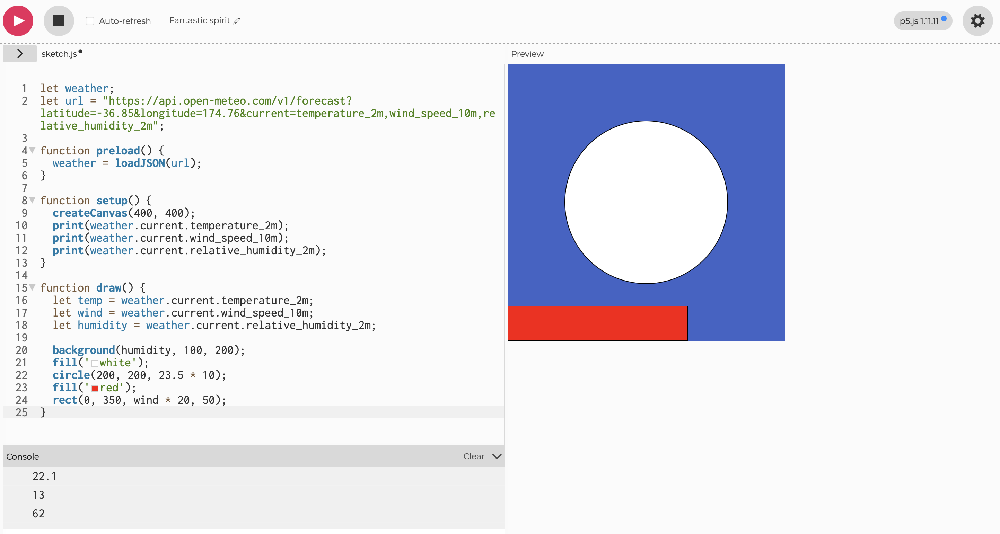
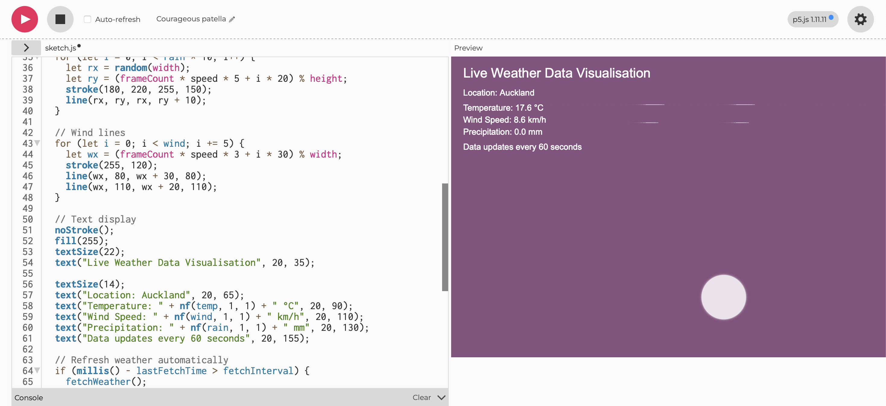

## Week 03
 
Our third tutorial of the class began by peer checking our work from the previous week to showcase our individual potraits. Then after our tutors came around to help setup everyones Github account to be able to have live diary entries uploaded per week on our websites. After that we began learning about our third module. 

### Live Data

In the first activity, I used the terminal along with documentation from wttr.in and the Free Dictionary API to experiment with cURL. Here is a video of one of those examples.

[Watch The Video](https://youtube.com/shorts/VuvIPaD7ygo?)

In the second activity, I opened a demo sketch in the p5.js editor that used the Open-Meteo API to fetch live weather data for Auckland and translate it into visual outputs. I experimented by changing the location coordinates to different cities and observing how the visuals changed. I mapped different weather variables to visual properties such as colour, size, position, and the number of shapes. I also added extra variables from the API documentation and tested functions like random() and noise() to create more dynamic outputs. I used print() in the console to better understand the data ranges before visualising them, and I pushed the sketch further by trying more ambitious variations.

In the final activity, I worked in a pair to design and execute a data protocol. We created a set of clear, rule-based instructions for translating a live data source into analogue outputs. We defined the data source, how frequently observations should be recorded, and how each observation would be mapped into marks or actions. We wrote the protocol clearly on paper so that someone else could follow it without needing further explanation.

### Reflective Summary

This set of activities helped me better understand how data can be translated into both digital and physical forms through structured systems. I developed confidence in working with live APIs and learned how to interpret and map real-time data into visual outputs using p5.js. Experimenting with variables like position, colour, and scale showed me how data can directly influence design decisions.

The analogue data protocol also shifted my thinking, showing me that data translation is not limited to coding but can exist through simple, rule based processes. Overall, these exercises strengthened my understanding of generative design and how structured inputs can lead to creative and unpredictable outcomes.

### Independent Live Data Visulisation

I developed an independent p5.js sketch that responded to live data by integrating an external API that I sourced myself. I mapped incoming data values to visual properties such as colour, size, position, and movement. This allowed the sketch to continuously change in response to the live data, creating a visual system that evolved over time.

The visualisation revealed aspects of the data that would be difficult to notice through raw numbers alone, such as fluctuations, trends, and intensity over time. I also explored how the rhythm of the data influenced the pacing and behaviour of the visuals, creating a direct relationship between real-world changes and on-screen motion.

Throughout the process, I used the p5.js reference and external tutorials to learn new techniques, and I also experimented with using AI tools to extend the complexity of my sketch. This helped me develop both my technical skills and my ability to think creatively about how data can be experienced through design.

### Reflection 

A key part of my code was how I mapped the incoming data to visual properties. For example, I used functions like map() to translate data ranges into values that control colour, size, position, and movement. This meant that changes in the data would immediately influence how the visuals behaved on screen. I also introduced motion through variables such as frame count and speed, which helped create a sense of rhythm and flow that reflected the changing nature of the data.

Another important aspect was managing how often the data updates. I implemented a timed refresh using functions like millis() so the API would be called at intervals rather than every frame. This kept the sketch efficient while still allowing it to feel live and responsive. I also structured the code into clear sections, separating data fetching, data handling, and visual output, which made it easier to understand and build on.

Overall, the code I created demonstrates how live data can be transformed into a dynamic visual system. It shows my ability to combine technical processes like API integration with creative decisions around visual mapping, resulting in an interactive sketch that evolves over time.