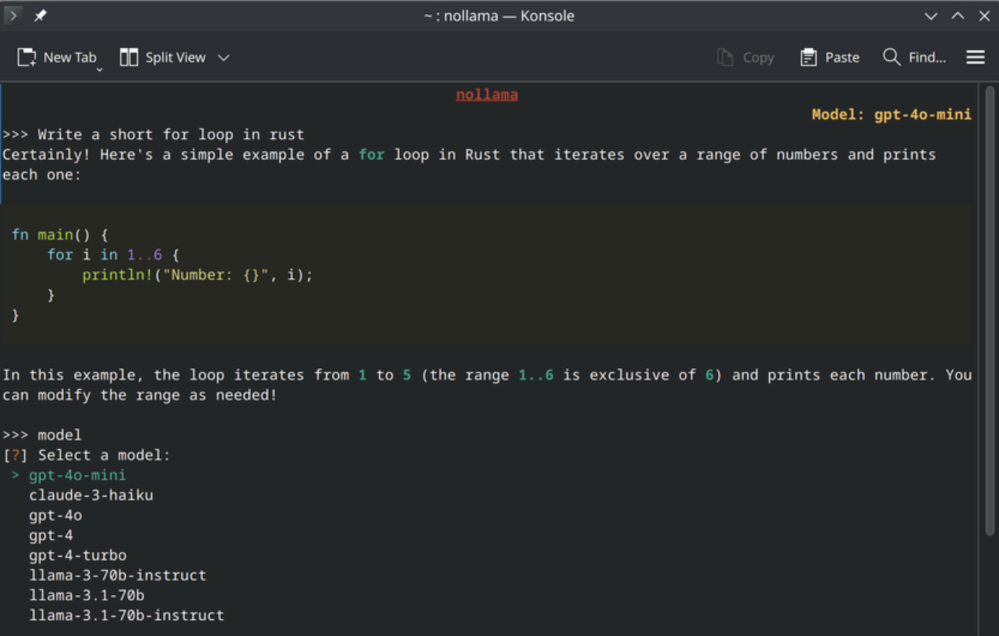
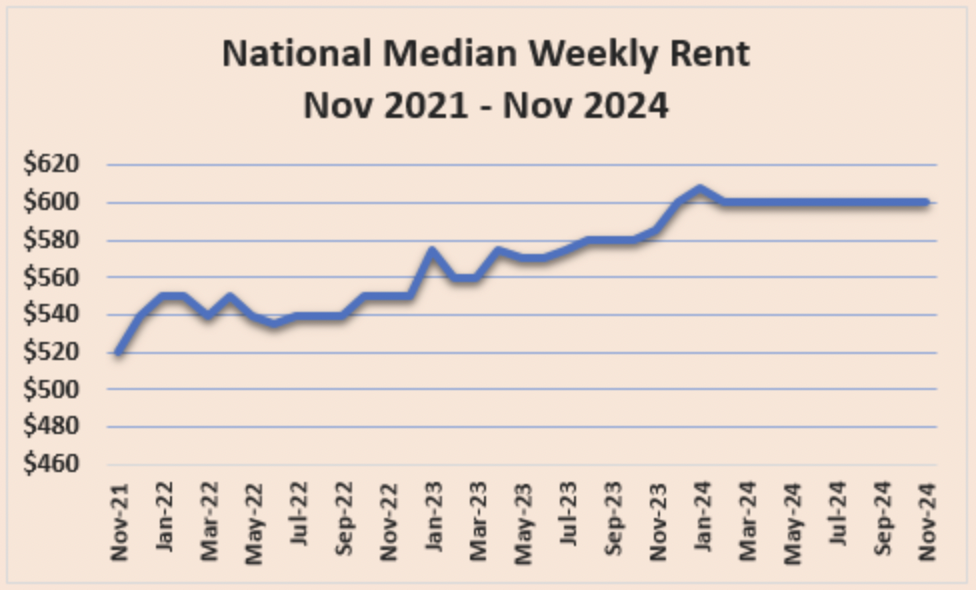

## Week 04

In our fourth tutorial our class went through the final module for this half of the semester. The overview for this class was exploring local and cloud-based AI workflows. We essentially used AI to build upon our previous experiments.  

### Artificial Intelligence 

In Activity 1, I installed Ollama and used the terminal to download and run a local AI model on my computer. I spent time experimenting with it by describing data from previous projects and asking for visualisation ideas, as well as generating code. I compared its responses to what I would normally get from tools like ChatGPT and noticed clear differences in speed and depth. While the responses were slightly less refined, I found it interesting that everything was processed locally, which made me more aware of the trade-off between privacy and capability. Testing its limits helped me understand both the strengths and constraints of running AI models offline.

In Activity 2, I used NotebookLM to explore cloud-based AI in a more structured way. I created a notebook and added a range of sources including my own work, practitioner references, and other materials I had engaged with throughout the course. I then wrote a short context document to guide the AI, which helped shape the direction of the responses. Using the chat feature, I asked reflective and critical questions about my work, which revealed patterns in my interests and highlighted ideas I had not fully considered before.

Overall, these activities allowed me to compare local and cloud-based AI systems in practice. I gained a better understanding of how different tools can support the design process in different ways, from quick experimentation and code generation to deeper reflection and synthesis of ideas.

### Reflective Summary 

These activities gave me a clearer understanding of how different AI tools can support my design process in distinct ways. Working with a local model using Ollama highlighted the importance of privacy and control, while also showing the limitations in speed and response quality compared to cloud-based tools like ChatGPT. It made me more aware of the trade-offs between independence and performance when choosing tools.

Using NotebookLM allowed me to engage more critically with my own work by organising sources and generating insights across them. The ability to ask reflective questions and listen to an audio overview helped me see patterns in my practice that I had not fully recognised before. Overall, these activities expanded my understanding of AI as both a practical and reflective tool within design.

### Independent AI-Assisted Data Exploration

I selected the rental bond data by territorial authority from New Zealand Government Data Service as my dataset because it reflects a key aspect of everyday life in Aotearoa New Zealand: housing and renting. The dataset is provided by Ministry of Business, Innovation and Employment through Tenancy Services and includes monthly records of bond lodgements across different regions. I was drawn to this dataset because it offered both a manageable CSV file and a long historical timeline, allowing me to explore patterns over time while staying grounded in a real social issue.

After uploading the dataset into cloud-based AI tools such as ChatGPT and NotebookLM, I began by asking the AI to explain the structure of the data. This helped me understand the meaning of each column, the time range, and the overall scale of the dataset. Through this process, I identified potential stories around regional differences in renting and how rental activity has shifted over time. I also recognised limitations, such as the fact that the dataset only captures bond lodgements rather than the full lived experience of renting, highlighting how government-collected data can reflect administrative priorities rather than social realities.

I then worked through multiple iterations of data representation instead of accepting the AI’s initial output. The first visualisation was a standard chart showing trends over time, which felt predictable and generic. I pushed the AI to produce alternative representations, including comparative visuals between regions and a more experimental approach that translated data into dynamic visual behaviour. This iterative process made it clear that meaningful outcomes required direction and critique, as the AI tended to default to safe design choices such as basic charts and neutral colour schemes unless guided otherwise.

### Reflection
Overall, this project showed me that working with AI is not about generating a single result, but about engaging in an ongoing dialogue. The most valuable insights came from questioning the AI’s assumptions, refining prompts, and making deliberate design decisions rather than relying on its default outputs. I also became more aware of how easily AI can oversimplify complex social issues like housing if it is not critically guided. 

If I were to develop this further, I would focus on creating a more refined and interactive visualisation that better communicates the human impact behind the data, potentially incorporating user input or layering multiple datasets to add depth. I would also spend more time refining the visual language to make it more engaging and intentional, rather than purely functional. This experience strengthened my ability to critically use AI as a tool, not just for efficiency, but as an active collaborator that still requires direction, judgement, and design thinking.